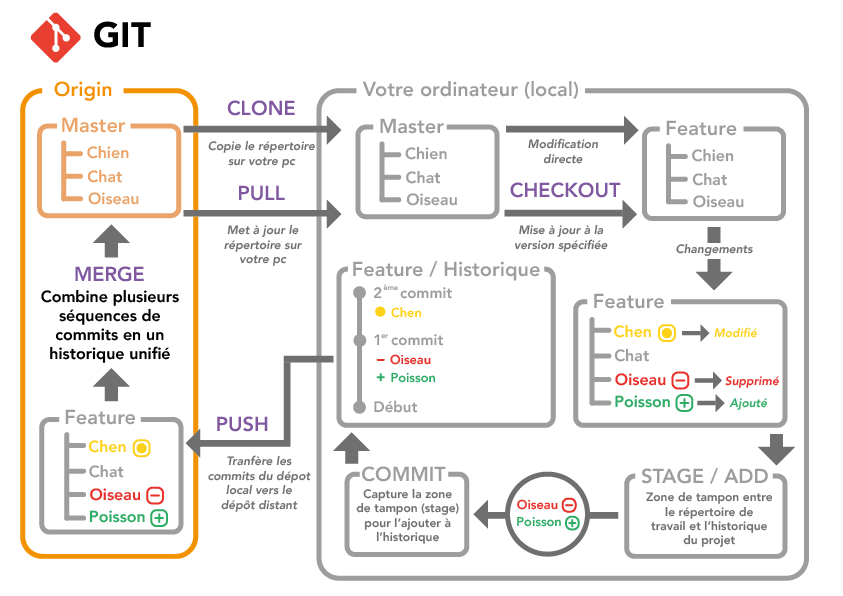
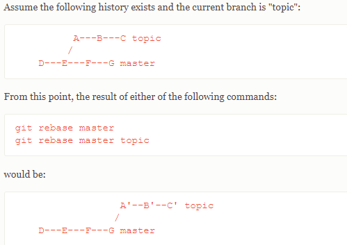

# GIT : Comment l'utiliser?

## **Qu'est-ce git?**

Git est un système de contrôle de version. 

C'est un outil de développement qui aide une équipe de développeurs ou autre à gérer les changements apportés au code source/documents autres au fil du temps.

## **A quoi sert github ou gitlab?**

Ce sont des logiciels/site web libre de forge basé sur le logiciel git proposant :
- des fonctionnalités de wiki,
- un système de suivi des bugs,
- intégration,
- livraison continue.

## **Commandes git / Methodes de travail**

### *Commandes d'initialisation*

- *git init* :                                                 initialise le dossier en question en dépôt Git
- *git clone* <url_repo>l* :                                   clone le repo distant dans un repo local (là où est lancé la commande git)
- *git switch -c "nom de la branche"* :                        permet de créer une nouvelle branche à partir de la branche où est lancé la commande
- *git switch "nom de la branche"* :                           permet de changer vers la branche "nom de la branche"

### *Commandes utilitaire*

- *git status* :                                               permet d'avoir le statut du dépôt Git dans laquelle on est
- *git log* :                                                  permet d'afficher les logs du projet git => liste des commit, et diffs sur les diverses branches
  
     petite commande git qui affiche un historique assez sympathique : git log --graph --date=relative --pretty=tformat:'%Cred%h%Creset -%C(auto)%d%Creset %s %Cgreen(%an %ad)%Creset' --all
- *git branch -a* :                                            permet d'afficher la liste des branches locales et en remote
- *git branch -l* :                                            permet d'afficher la liste des branches locales 
- *git branch -r* :                                            permet d'afficher la liste des branches remotes
- *git branch -vva* :                                          permet d'afhicer les branch avec des détails tels que des commits id

### *Commandes de modifications du dépôt:*

- *git pull* :                                                 rapatrie les modifications distantes dans la branche actuelle (git pull --rebase fait un gir rebase au lieu d'un merge)
- *git fetch* :                                                permet de récupérer l'historique du dépôt sans modifier la branche locale
- *git push* :                                                 permet de mettre à jour les modifications locales dans la distante
- *git rebase<branch to rebase with> <branch to be rebased>* : mets des commits au top d'une autre base id

- *git cherry-pick* :                                          applique des changement introduits dans des commits déjà existants

### *Commandes pour mettre les modifications de code sur le distant:*

- *git add <fichier>* :                                       ajoute le contenu de fichiers à l'index en cours
- *git commit -m <message du commit>* :                       enregistre les modifications dans le dépôt local
- *git checkout <nom du fichier>* :                           enlever les commits et modifications du fichier en question

## **Process Git + commandes:**

> Un projet de base est obligatoirement constitué de 2 branches de références:
1. *master* : branche de références pour les livraisons + tag, branche de départ pour les hotfix sur des livraisons ou mise en prod
2. *main* : branche de référence de travail pour le projet

> En cas de modification de code, il faut partir d'une branche de référence et créer une nouvelle branche afin de pouvoir y travailler dessus.
1. Se placer sur la branche de référence : *git checkout -b main*
2. faire un git fetch pour mettre à jour l'historique du dépôt de la branche de référence et faire un git pull si nécessaire
3. Créer une nouvelle branche : *git checkout -b <nom de la nouvelle branche>*
4. Faire les modifications de code ou de documents
5. Tester votre code, voir s'il n'y a pas eu de régression.
5.  : ajoute le fichier modifié à commit, possible de faire plusieurs ajouts avant un commit
6. *Git commit -m <message du commit>* : enregistre les modifications du fichier dans le dépôt local
7. *Git push *: mettre à jour le local avec le distant

> Si vous voulez merge votre code dans la branche de référence.
1. Aller sur la branche de référence : *git checkout main*
2. Mettre à jour la branche: *git fetch*  *git pull*
3. Aller sur la branche de travail et faire un rebase : *git rebase main*
4. Corriger les conflits si nécessaire.
5. Tester la branche rebasée et voir s'il n'y a pas eu de régression
6. Aller sur la branche de référence, et merger : *git merge <branche de travail>* 

## **Process GitLab Github:**

> Tagguer chaque livraisons ou version logicielles importantes 

> Créer des tickets ou tickets chapeau pour chaque tâche de développement

Un ticket chapeau est une macro tâche pouvant être divisées en plusieurs plus petites tâches.
Chaque ticket doit comporter :
- le statut d'avancement de la tâche
- la description de la tâche
- le moyen pour réaliser la tâches
- la description du résultat de la tâche
> Nommer les commit et/ou les branches en fonction des numéro ou titre de tickets créés

> Ne jamais travailler sur une même branche à plusieurs hormis les branches de références : le process ci-dessus permet de limiter les problèmes
